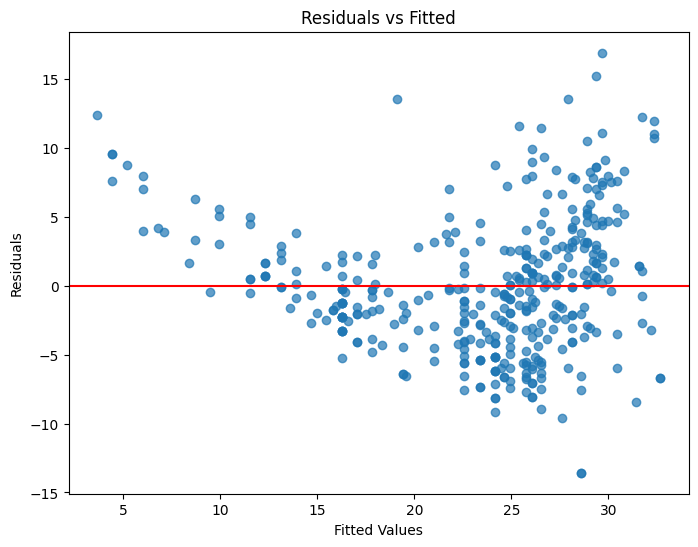

[← Home](https://brianlimtt.github.io/TER-blog/) 
- **Jupyter Notebook (.ipynb):** [Link](https://github.com/brianlimtt/TER/blob/main/linear-regression-auto/Linear%20Regression%20Auto.ipynb)
   
   
# Linear Regression Analysis of Horsepower vs. Price

This project explores the relationship between **horsepower** and **price** of vehicles using linear regression. We aim to build a predictive model and analyze how changes in horsepower impact vehicle prices.

---

## Table of Contents
1. [Data Exploration](#data-exploration)
2. [Building the Model](#building-the-model)
3. [Making Predictions](#making-predictions)
4. [Model Evaluation](#model-evaluation)
5. [Key Takeaways](#key-takeaways)
6. [Next Steps](#next-steps)

---

## Data Exploration

We started by inspecting the dataset, checking for missing values, and visualizing relationships. Scatter plots between **horsepower** and **price** revealed a roughly linear trend, which is ideal for linear regression.
 

> *Figure 1: Scatter plot showing the relationship between horsepower and price.*

---

## Building the Model

A linear regression model was created to estimate the relationship between horsepower and price. The regression equation is:

$$
\text{Price} = \beta_0 + \beta_1 \cdot \text{Horsepower}
$$

Where:  
- `β0` = intercept  
- `β1` = slope, representing the change in price per unit increase in horsepower.

This equation allows us to quantify how much price increases for each additional unit of horsepower.

---

## Making Predictions

Using the regression model, we can predict the price of a vehicle with a given horsepower. For example, a vehicle with **98 horsepower** has a predicted price calculated from the equation above.  

Predictions also include a **95% confidence interval**, showing the range in which we can be reasonably confident the true price falls.

> *Figure 2: Visualization of predicted prices with confidence intervals.*

---

## Model Evaluation

The model was evaluated for accuracy and reliability:

- **R-squared**: Measures how much of the variation in price is explained by horsepower.  
- **Residual analysis**: Checks for patterns that might indicate violations of linear regression assumptions, such as non-linearity or inconsistent spread of residuals.

> *Figure 3: Residual plot showing the spread of residuals around zero.*

---

## Key Takeaways

- **Positive correlation**: Higher horsepower generally results in higher prices.  
- **Simple and effective**: Linear regression works well with a single predictor.  
- **Confidence intervals**: Provide insight into the reliability of predictions.  
- **Residual checks**: Confirm that model assumptions are reasonable.

---

## Next Steps

- Extend the model to include multiple predictors, such as weight, engine size, or fuel efficiency.  
- Explore non-linear models if relationships are not perfectly linear.  
- Compare predicted prices with actual market prices for validation.  
- Visualize model predictions on new datasets for further insights.

---

> *This analysis demonstrates a straightforward application of linear regression to real-world vehicle data, showing how predictive modeling can help understand and forecast trends.*
